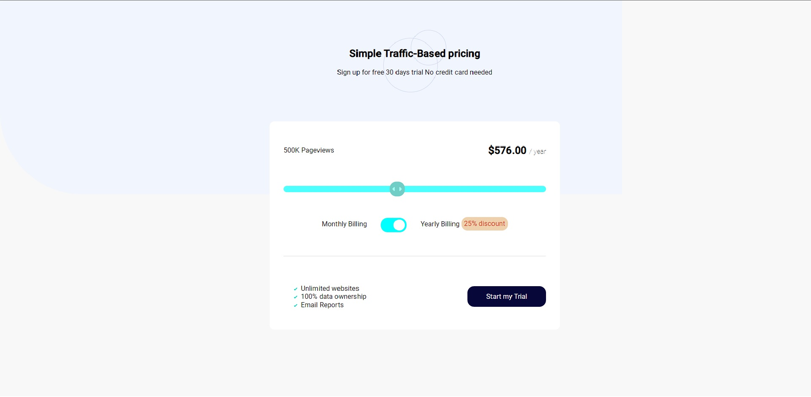
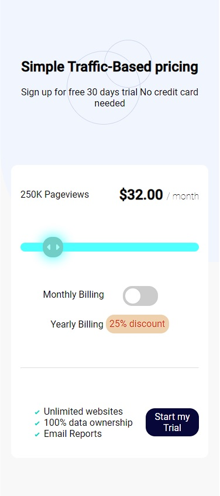

# Frontend Mentor - Interactive pricing component solution

This is a solution to the [Interactive pricing component challenge on Frontend Mentor](https://www.frontendmentor.io/challenges/interactive-pricing-component-t0m8PIyY8). Frontend Mentor challenges help you improve your coding skills by building realistic projects. 

### The challenge

Users should be able to:

- View the optimal layout for the app depending on their device's screen size
- See hover states for all interactive elements on the page
- Use the slider and toggle to see prices for different page view numbers

### Screenshot


<div align="center">
    
</div>

### Built with

- HTML5 
- 👨‍🎨SCSS
- Flexbox
- 🧀JS
- ⚛[React](https://reactjs.org/) - JS library
- 📦Webpack


### What I learned

I learned how to style -webkit things.I figured out webpack config this help me with git i worked on git stages and commits i undersood pushes to repositories

```html
<!DOCTYPE html>
<html lang="en">
<head>
    <meta charset="UTF-8">
    <meta http-equiv="X-UA-Compatible" content="IE=edge">
    <meta name="viewport" content="width=device-width, initial-scale=1.0">
    <title>Document</title>
</head>
<body>
    <div id="root"></div>
</body>
</html>
```
```scss
.container__down{
    border-radius: 0.7rem;
    background-color: white;
    width: 35%;
    margin: auto;
    padding: 2rem;
    @media #{$mobile} {
        width: 90%;
        padding: 1rem;
    }
    .down__view_price{
        display: flex;
        justify-content: space-between;
        align-items: center;
        h2{
            align-items: center;
            span{
                font-weight: 100;
                font-size: 1rem;
            }
        }
    }
    .down__range_check{
        text-align: center;
        align-items: center;
        p{
            display: inline-block;
            margin-top: 1rem;
            vertical-align:sub;
            span{
                background-color: rgb(238, 208, 173);
                padding: 0.4rem;
                border-radius: 0.9rem;
                color: rgb(224, 85, 30);
            }
        }
    }
}
```
```js
const Container=(props)=>{
    const [rangeValue,setRangeValue]=useState(8)
    const price=16
    const views=50
    const [monthYear,setMonthYear]=useState(false)

    const handleChange=(e)=>{
        setRangeValue(parseInt(e.target.value))
      }
      const handleChangeYearMonth=(e)=>{
        setMonthYear(!monthYear)
      }
    const priceHandler=()=>{
        return monthYear ? rangeValue*price*12*0.75 : rangeValue*price;
    }
    const viewHandler=()=>{
        return views*rangeValue*2.5
    }
    return (
    <div className='container'>
        <div className='container__upper'>
            <h2>Simple Traffic-Based pricing</h2>
            <p>Sign up for free 30 days trial No credit card needed</p>
        </div>
        <Baner viewHandler={viewHandler} priceHandler={priceHandler} handleChange={handleChange} handleChangeYearMonth={handleChangeYearMonth} rangeValue={rangeValue} monthYear={monthYear}/>
    </div>
    )
}
```


### Continued development

In the future i would focus on styled components in react and how to use it perfect
also. I made more layouts with scss i think this is stunning technology.

**Note: Delete this note and replace the list above with resources that helped you during the challenge. These could come in handy for anyone viewing your solution or for yourself when you look back on this project in the future.**

## Author

#####Jakub Zajkowski
[Github](https://github.com/jakubzajkowski)
